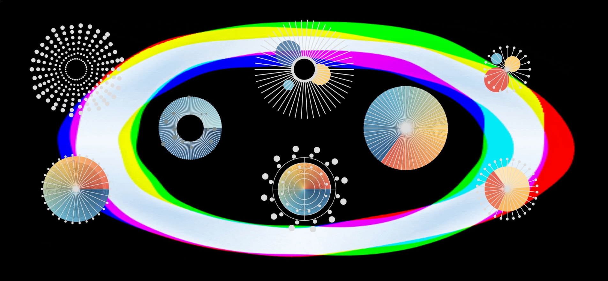
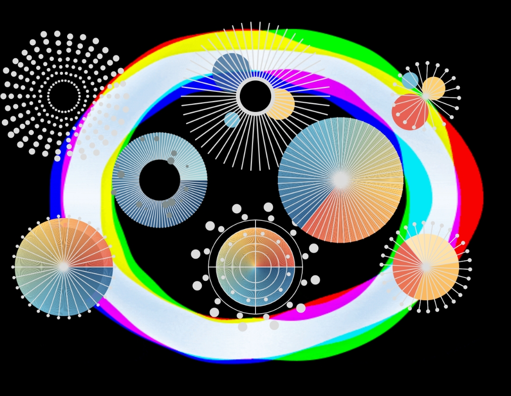
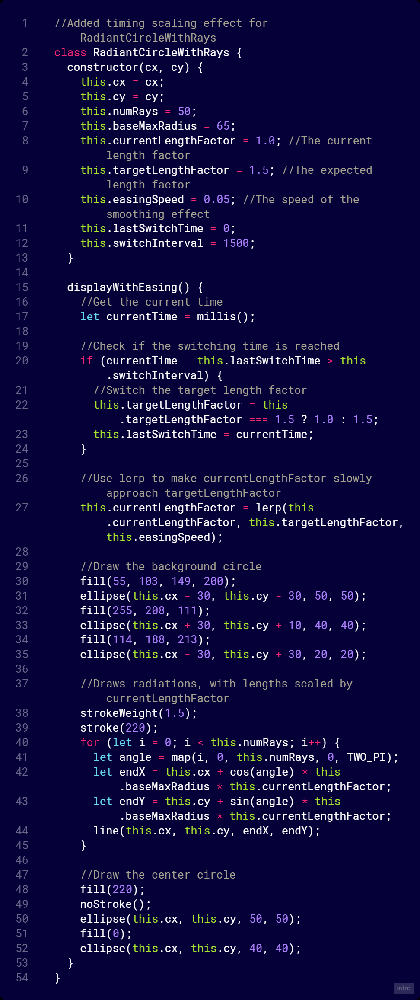
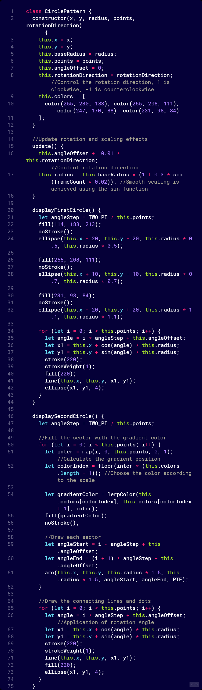
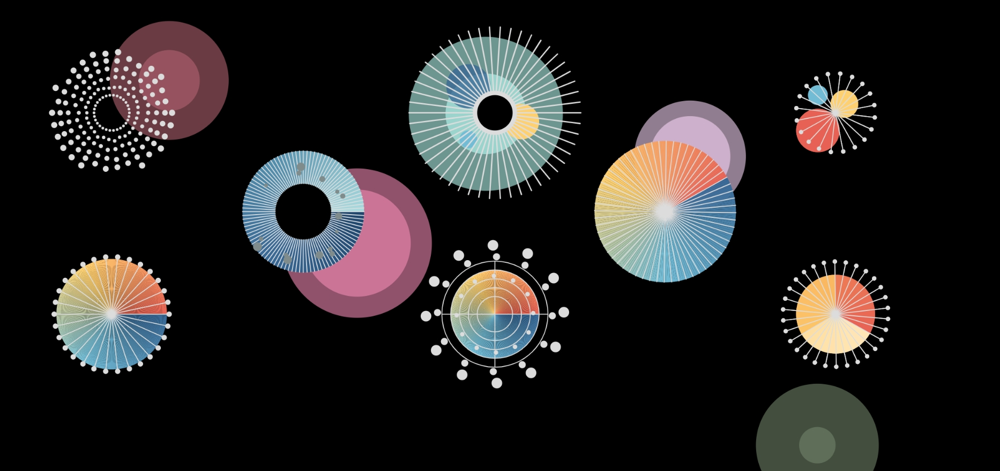

# **IDEA9103-Creative-coding-major-project **
## Individual Work

## Part 1 Work Description
My work is inspired by Japanese photographer Mika Ninagawa. Her works are known for their colorful and dreamlike colors. She especially likes to use flowers and goldfish as the main elements to create a vibrant picture and atmosphere. In this work, I try to interpret the elements of flowers with circles and lines. Different animations express various characteristics and personalities among flowers, such as enthusiasm, implicitness and changefulness.

#### *Mika Ninagawa's work *

In the effects section, I chose to create my own work using Time-Based. Considering the effects of other group members, this work tries to avoid the possibility of similar effects, such as the ups and downs of similar audio or noise. On the basis of group work, I modified the wide range of color matching, increasing saturation and brightness. Instead of keeping all the patterns, I selected some of them as the base elements for the re-creation and adjusted their positions, which centralizes the canvas. This works better when the screen size is 5:4.

#### *Full screen size *

#### *Better screen size *

## Part 2 Design Description
The timing scaling effect is applied to the four figures. In the case of Radiantcircles, I first defined them at the beginning of the overall code, but added their specified locations in function setup and instructions to add draws in function draw. Next, I initialize their properties in class, such as the x and y coordinates of the circle, the number of rays, the maximum and minimum radius, the factor that controls scaling, and the speed of easing. In display, I used the lerp function to interpolate scaleFactor smoothly close to targetScaleFactor to produce a slowing effect. In addition, the if statement is used to detect whether scaleFactor is close to targetScaleFactor. Once close, the target ratio is switched between 0.8 and 1.2, achieving a scaled timing loop effect. When drawing the lattice pattern, I use the map function to evenly distribute the points in the Angle range from 0 to TWO_PI, and the for loop will extend the points in each direction in increments of random(8, 12) to random intervals. dotSize is used to control the size of the point.

#### *RadiantCircle section of the code *

In addition, I also used a rotation effect. Taking CirclePattern as an example, two circles need to achieve opposite rotation directions to avoid visual fatigue. First of all, I set the values for different rotation directions in the setup in advance. I used rotationDirection to control the rotation direction of the pattern, where 1 is clockwise and -1 is counterclockwise. In update, angleOffset can be used to control the rotation Angle of the pattern. Each update() call increases the rotation Angle according to rotationDirection. radius uses the sin function to achieve dynamic scaling, which allows the pattern to smoothly zoom in and out within a certain range. Finally, I set up different displays for each of them to draw patterns separately and fill them with different colors.

#### *CirclePattern section of the code *

It is worth noting that I have repeatedly tried to draw the background pattern myself. However, probably due to the conflict between the different functions, my attempt ended in failure. The dynamic circle of the background couldn't control the frequency of the change, even by adjusting the value of easing multiple times, so I had to use GIFs to replace the out-of-control background pattern. Given the opportunity, I will continue to explore this issue.

#### *Unsuccessful background *